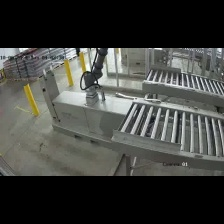

# **Cobot-State Classifier**

This project is focused on developing a **Cobot-State Classifier** model that classifies the operational states of an industrial cobot. It has been created exclusively for [Robominder LTD](https://www.robominder.ai/) and is hosted privately for demonstrational purposes.

## **Model Overview**
The model utilised for this project is the **Temporal Shift Module (TSM)** by [Ji Lin, Chuang Gan, Song Han](https://arxiv.org/abs/1811.08383). The PyTorch implementation of the TSM model was accessed and adapted from its [official GitHub Repository](https://github.com/mit-han-lab/temporal-shift-module).

Rationale:
TSM was selected for its outstanding performance in action recognition tasks, including ranking first on the "Something-Something" leaderboard. For this project, the ResNet50 backbone was chosen for feature extraction, and despite using a relatively heavier backbone, the overall model remains lightweight and efficient due to TSM's simple and computationally efficient design. Experimental results demonstrated that the model consistently achieves over 90% accuracy and F1 scores in cobot-state classification, with average inference times between 20–80 ms on an NVIDIA A100 GPU.

## **Dataset**
The dataset consists of frame sequences extracted from cobot video files provided by [Robominder LTD](https://www.robominder.ai/).

- **Data Policy**: The dataset used in this project is proprietary and remains strictly internal to Robominder LTD and its collaborators. Distribution or external sharing is restricted to ensure compliance with confidentiality agreements.

### **Data Format**
- The dataset comprises approximately **700 start** and **800 stop** sequences.
- Each sequence consists of **non-overlapping** 5-second intervals, extracted at **3 fps**, resulting in **15 frames per sequence**.
- Frames have been pre-processed to a resolution of **224x224 pixels** to be compatible with the **TSM** model input.

### Sample Cobot Operational States

Below is a visual representation of sample frame sequences for **Start** and **Stop** states of the cobot.

### Start Sample

  
  
  
  
  
  
  

  
  
  
  
  
  
  

---

### Stop Sample

  
  
  
  
  
  
  

  
  
  
  
  
  
  

## **Model Training**
Two pre-trained models were developed for this project, each using a different data split strategy:

1. **Sequential Data Split**: 
   - **Testing Setup**: 120 consecutive "start" sequences and 120 consecutive "stop" sequences were held out exclusively for testing. 
   - **Training Setup**: The remaining sequences were used for training.
   - **Objective**: To evaluate the model's generalization ability on a completely unseen distribution of data.
   - **Model File**: [Sequential Split Model](experiments/sequential_split_final/cobot_tsm_model.pth)

2. **Random Data Split**:
   - **Setup**: An 80-20 train-test split was applied, ensuring random sampling of sequences across the dataset.
   - **Objective**: To assess the model's performance under typical data distribution.
   - **Model File**: [Random Split Model](experiments/random_split_final/cobot_tsm_model.pth)
   
The models and dataset were hosted on QMUL's High Performance Compute Cluster, with training conducted on an NVIDIA A100 GPU.

### **Dataset Handling**
The dataset handler was designed to load frames in three distinct modes:
- **2-Second Interval**: Selects the first 5 frames of each sequence.
- **5-Second Interval**: Selects 5 frames evenly spaced across the sequence.
- **Random**: Selects 5 frames randomly from the 15-frame sequence.

Both models were trained using the **random frame selection mode**, which demonstrated superior robustness compared to training on fixed intervals (2-second or 5-second modes) alone.

## **Data Augmentations and Preprocessing**
The following transformations were applied during training to improve robustness, generalisation and impose a degree of regularisation due to the relatively small dataset:

1. **Random Horizontal Flip**: Applied with a probability of 50%.
2. **Affine Transformations**: Rotations up to ±5 degrees, translations up to 2% of the image dimensions, and scaling within the range of 95–105%.
3. **Random Perspective Distortion**: Distortion scale of 0.1, applied with a probability of 50%.
4. **Color Jitter**: Adjustments for brightness and contrast within ±30%.
5. **Gaussian Blur**: Kernel size of 3, sigma values randomly chosen between 0.1 and 0.5.
6. **Normalisation**:
   - Standardised with a mean of `[0.5, 0.5, 0.5]` and std of `[0.5, 0.5, 0.5]` to scale pixel intensity within `[-1, 1]` for compatibility with the TSM model.

## **Reproducibility**
The scripts provided are designed to be straightforward for both testing the pre-trained models and training from scratch.

### **Steps for Setup**
**Clone the repository**
### For Testing
- Ensure images are 224x224px
1. Update the following variables in **tester.py** with the correct paths:
   - Line 98: Path to start_sequences.
   - Line 99: Path to stop_sequences.
   - Line 102-103: Paths to the model/s .pth
2. (Optional) Choose the test mode in line 114:
   - split_mode="random": For testing the model trained on random splits.
   - split_mode="sequential": For testing the model trained on sequential splits.
   - Run the **tester.py**.

The script will output:
 - Classification metrics (accuracy, precision, recall, F1-score).
 - A confusion matrix.
 Optionally, the testing workflow is also available as a Jupyter Notebook in test_model_notebook.ipynb

### Training from Scratch:
- Ensure images are 224x224px
1. Open **trainer.py**.
2. Update the following variables:
   - Line 156: Path to start_sequences.
   - Line 157: Path to stop_sequences.
3. (Optional) Adjust hyperparameters:
   - Lines 166–169: Modify batch size, learning rate, epochs, or other settings as needed.
   - Run **trainer.py**.

## **Test Results**
**Results for Random-Split Model:**
 - Accuracy: 0.96
 - Precision: 0.9685
 - Recall: 0.9675
 - F1 Score: 0.9676

**Confusion Matrices:**
Below are the confusion matrices showcasing the model's classification performance for "start" (operational) and "stop" (non-operational) states.

|                | Predicted Start | Predicted Stop |
|----------------|-----------------|----------------|
| **Actual Start** | 64              | 1              |
| **Actual Stop**  | 4               | 85             |

**Average Inference Time:** 94.04 ms*  
*Value may be slightly inflated due to GPU and kernel initialisation overhead.*

**Results for Sequential-Split Model:**
 - Accuracy: 0.96
 - Precision: 0.9667
 - Recall: 0.9667
 - F1 Score: 0.9667

**Confusion Matrix:**

|                | Predicted Start | Predicted Stop |
|----------------|-----------------|----------------|
| **Actual Start** | 116            | 4              |
| **Actual Stop**  | 4              | 116            |

**Average Inference Time:** 5.57 ms  

[See results log](experiments/results/test_results.log)
